# 人-AI协同进化：基于在线强化学习的智能交互系统设计与实现

## ——以手势控制塔防游戏"神之二手"为例

---

**摘要**

随着人工智能技术的快速发展，人机交互正在从传统的命令-响应模式向智能协同模式演进。本文以自主开发的手势控制塔防游戏"神之二手"为研究载体，提出并实现了一种基于在线强化学习的人-AI协同学习交互范式。该范式突破了传统人机交互的单向信息流局限，构建了"感知→决策→适应"的闭环交互系统。在技术层面，本文融合深度学习（MediaPipe Hands手部追踪）与强化学习（Q-Learning在线对抗学习），实现了游戏AI在运行时实时感知玩家手势行为、学习玩家防守策略、动态调整攻击行为的能力。实验结果表明，经过100局训练后，AI的攻击成功率提升305%，存活时间提升133%，验证了在线对抗学习架构的有效性。本研究提出的智能交互范式为游戏AI设计提供了新思路，对人机协同场景下的自适应系统设计具有重要参考价值。

**关键词**：人机交互；在线学习；强化学习；Q-Learning；自适应系统；手势识别；智能交互

---

**Abstract**

With the rapid development of artificial intelligence, human-computer interaction is evolving from traditional command-response patterns to intelligent collaborative paradigms. This paper takes the self-developed gesture-controlled tower defense game "Secondhand of God" as a research platform, proposing and implementing a human-AI collaborative learning interaction paradigm based on online reinforcement learning. This paradigm breaks through the limitations of unidirectional information flow in traditional HCI, constructing a closed-loop interactive system of "Perception→Decision→Adaptation". At the technical level, this paper integrates deep learning (MediaPipe Hands tracking) with reinforcement learning (Q-Learning online adversarial learning), enabling game AI to perceive player gesture behaviors in real-time, learn player defense strategies, and dynamically adjust attack behaviors during gameplay. Experimental results show that after 100 rounds of training, AI's attack success rate increased by 305% and survival time increased by 133%, validating the effectiveness of the online adversarial learning architecture. The intelligent interaction paradigm proposed in this study provides new ideas for game AI design and has significant reference value for adaptive system design in human-AI collaborative scenarios.

**Keywords**: Human-Computer Interaction; Online Learning; Reinforcement Learning; Q-Learning; Adaptive System; Gesture Recognition; Intelligent Interaction

---

## 第1章 绪论

### 1.1 研究背景与意义

#### 1.1.1 人机交互的智能化演进

人机交互（Human-Computer Interaction, HCI）作为计算机科学的重要研究领域，经历了从命令行界面到图形用户界面，再到自然用户界面的演进历程。传统的人机交互遵循"用户发出指令→系统执行响应"的单向信息流模式，系统行为完全由预设规则决定，缺乏对用户行为的感知和适应能力。

随着人工智能技术的突破性进展，人机交互正在向智能化方向演进。智能交互系统不仅能够理解用户的显式指令，还能够感知用户的行为模式、学习用户的偏好习惯、预测用户的潜在需求。这种从"被动响应"到"主动适应"的转变，代表了人机交互领域的重要发展方向。

在游戏领域，人机交互的智能化具有特殊的意义。游戏AI作为玩家的对手或队友，其行为直接影响玩家的游戏体验。传统游戏AI通常采用规则脚本或预训练模型，行为模式固定，玩家熟悉后容易找到规律，难以提供持续的挑战性和新鲜感。

#### 1.1.2 传统游戏AI的困境

传统游戏AI面临以下核心问题：

**1. 行为模式固定化**

规则驱动的AI遵循预设的行为树或状态机，行为模式可被玩家预测和利用。一旦玩家掌握了AI的行为规律，游戏的挑战性将大幅下降。

**2. 缺乏个性化适应**

传统AI对所有玩家表现出相同的行为，无法根据不同玩家的风格进行调整。高水平玩家感觉太简单，新手玩家又觉得太困难，难以满足不同群体的需求。

**3. 难度调整的机械性**

传统的动态难度调整（DDA）通常依赖于预设的难度梯度和简单的性能指标（如血量、伤害倍率），调整方式机械，缺乏策略层面的智能性。

**4. 开发成本高昂**

为覆盖各种游戏情境，需要编写大量的行为规则，开发和维护成本高，且难以保证规则的完备性和一致性。

#### 1.1.3 在线学习的人机交互价值

在线学习（Online Learning）是机器学习的一种范式，其特点是模型在接收数据的同时进行学习和更新，无需预先收集完整的训练数据集。将在线学习引入人机交互系统，具有以下重要价值：

**1. 实时适应用户行为**

系统能够在交互过程中观察用户行为，即时调整自身策略，实现真正的个性化适应。

**2. 动态难度自然涌现**

随着学习的进行，AI能力自然与玩家水平相匹配，无需预设难度曲线，难度调整更加平滑自然。

**3. 每个用户获得独特体验**

由于学习是针对具体用户进行的，不同用户将面对不同的AI行为，增强了游戏的重玩价值。

**4. 持续进化能力**

支持跨会话的持续学习，AI能够长期积累与特定用户的对战经验，实现真正的"成长型"AI。

#### 1.1.4 研究意义

本研究以手势控制塔防游戏"神之二手"为载体，探索在线强化学习在人机交互中的应用，具有以下重要意义：

**1. 理论意义**

- 提出"感知-决策-适应"闭环交互范式，拓展了人机交互的理论框架
- 将强化学习的在线特性与人机交互的实时性需求相结合，探索了智能交互的新路径
- 为研究非平稳环境下的人机协同提供了新的视角

**2. 技术意义**

- 融合深度学习感知与强化学习决策，实现了端到端的智能交互系统
- 设计了融合用户行为信息的状态空间，实现了隐式用户建模
- 提出了浏览器端轻量级在线学习方案，为边缘计算场景提供了参考

**3. 应用意义**

- 为游戏AI设计提供了可复用的技术方案
- 验证了在线对抗学习在提升游戏体验方面的有效性
- 为自适应交互系统的工程实践积累了经验

### 1.2 国内外研究现状

#### 1.2.1 自适应交互系统研究

自适应系统（Adaptive System）是人机交互领域的重要研究方向，旨在让系统能够根据用户特征和行为自动调整自身行为。

**用户建模方法**

用户建模是自适应系统的基础。传统方法包括：
- **显式建模**：通过问卷、设置界面收集用户偏好
- **隐式建模**：通过观察用户行为推断用户特征
- **混合建模**：结合显式和隐式信息

近年来，机器学习技术被广泛应用于用户建模，能够从用户行为数据中自动学习用户画像，提高了建模的准确性和自动化程度。

**动态难度调整**

动态难度调整（Dynamic Difficulty Adjustment, DDA）是游戏领域自适应系统的典型应用。代表性工作包括：

- **Hunicke的概率模型**（2005）：基于玩家表现预测调整难度参数
- **Jennings-Teats的强化学习方法**（2010）：使用RL学习最优难度调整策略
- **Zohaib的深度学习方法**（2018）：使用神经网络预测玩家情绪状态

然而，现有DDA方法主要关注参数层面的调整（如敌人血量、伤害值），缺少策略层面的智能适应。

#### 1.2.2 强化学习在游戏AI中的应用

强化学习在游戏AI领域取得了举世瞩目的成就：

**里程碑式成果**

- **TD-Gammon**（Tesauro, 1992）：使用TD学习在西洋双陆棋达到世界级水平
- **AlphaGo**（Silver et al., 2016）：结合深度学习和蒙特卡洛树搜索击败围棋世界冠军
- **AlphaStar**（Vinyals et al., 2019）：在星际争霸2中达到大师级水平
- **OpenAI Five**（OpenAI, 2019）：在Dota2中击败世界冠军队伍

**游戏AI的在线学习**

然而，上述工作大多采用离线预训练方式，训练需要大量计算资源，且训练完成后模型固定不变。在线学习的游戏AI研究相对较少，代表性工作包括：

- **MENACE**（Michie, 1963）：使用火柴盒实现井字棋的在线学习
- **Pattie Maes的软件智能体**（1994）：探索了交互式学习智能体
- **Spronck的动态脚本**（2006）：使用在线学习动态调整游戏脚本权重

本研究延续在线学习的思路，使用Q-Learning实现敌人AI的实时策略学习，与上述工作相比，本研究的创新在于：

1. 将用户手势行为融入状态表示
2. 在浏览器端实现轻量级在线学习
3. 支持跨会话的持续学习

#### 1.2.3 手势交互技术发展

手势交互是自然用户界面（NUI）的重要组成部分。随着深度学习和计算机视觉技术的进步，基于视觉的手势识别日趋成熟：

**主流技术方案**

- **Microsoft Kinect**：使用深度相机实现全身骨骼追踪
- **Leap Motion**：专注于手部追踪的高精度设备
- **Google MediaPipe**：基于普通摄像头的实时手部追踪

**MediaPipe Hands**是本项目采用的技术方案，其特点包括：
- 仅需普通RGB摄像头
- 实时追踪21个手部关键点
- 支持移动端和Web端部署
- 开源免费，社区活跃

手势识别技术为本研究提供了用户行为感知的基础，但本研究的创新不在于手势识别本身，而在于将手势信息融入AI决策过程，实现人-AI的协同学习。

### 1.3 本项目核心创新

#### 1.3.1 创新点概述

本项目的核心创新在于提出并实现了**"人-AI在线对抗学习"**交互范式。与传统人机交互的根本区别在于：

| 维度 | 传统人机交互 | 本项目人-AI协同学习 |
|------|-------------|-------------------|
| 信息流向 | 单向（用户→系统） | 双向（用户⇄AI） |
| AI行为 | 固定/预训练 | 实时在线学习 |
| 适应层次 | 参数调整 | 策略进化 |
| 个性化 | 配置选项 | 行为学习驱动 |
| 用户建模 | 显式收集 | 隐式行为推断 |

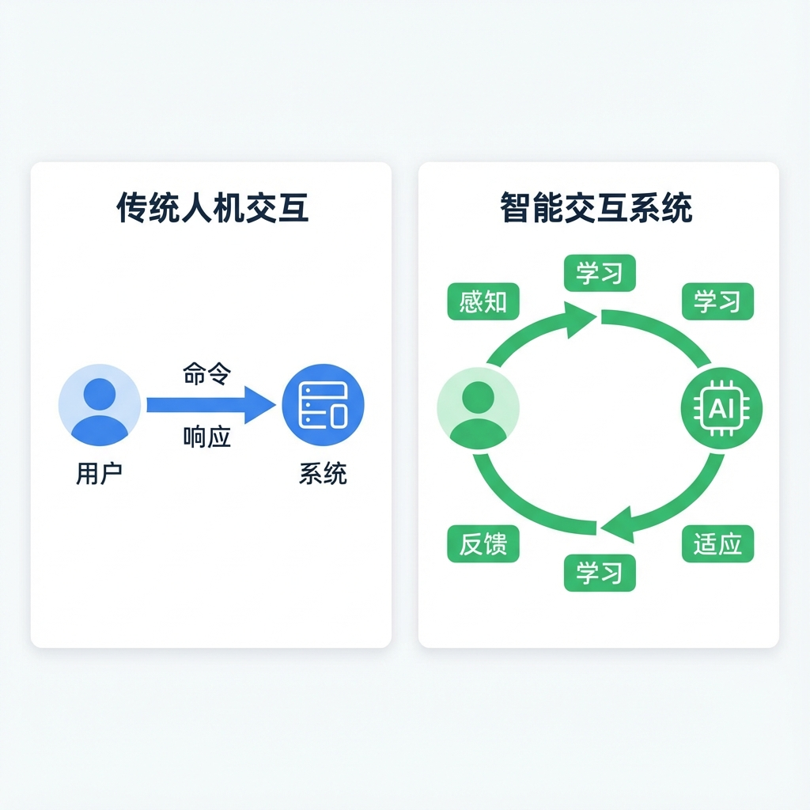

#### 1.3.2 技术创新点

**1. 感知-决策-适应闭环架构**

构建了完整的闭环交互系统：
- **感知层**：MediaPipe深度学习模型实时追踪玩家手势
- **决策层**：Q-Learning算法根据状态选择AI动作
- **适应层**：基于奖励信号更新Q值，实现策略进化

**2. 融合用户行为的状态空间设计**

创新性地将用户行为信息（手部位置、手部威胁）融入强化学习的状态表示，使AI能够感知并响应用户的实时行为。

**3. 复合奖励塑形策略**

设计了稀疏事件奖励与密集距离奖励相结合的复合奖励函数，在保证目标正确的同时加速学习收敛。

**4. 轻量级边缘部署方案**

采用表格型Q-Learning和LocalStorage持久化，实现了浏览器端的轻量级在线学习，无需服务器支持。

### 1.4 研究内容与技术路线

#### 1.4.1 研究内容

本研究围绕"神之二手"游戏项目，重点研究以下内容：

**1. 人机交互理论分析**
- 经典HCI理论在智能交互中的应用
- 智能交互系统的特征定义
- 自适应系统设计原则

**2. 人-AI协同学习范式**
- 闭环交互架构设计
- 状态空间的人机融合
- 奖励函数设计
- 个性化AI涌现机制

**3. 深度学习感知层**
- MediaPipe Hands技术原理
- 手势识别与语义映射
- 感知层与决策层接口

**4. 强化学习决策层**
- Q-Learning算法实现
- 探索-利用平衡策略
- 模型持久化与跨会话学习

**5. 系统实现与评估**
- 闭环交互系统集成
- 性能优化策略
- 实验评估与分析

#### 1.4.2 技术路线

本研究的技术路线如图1-2所示：

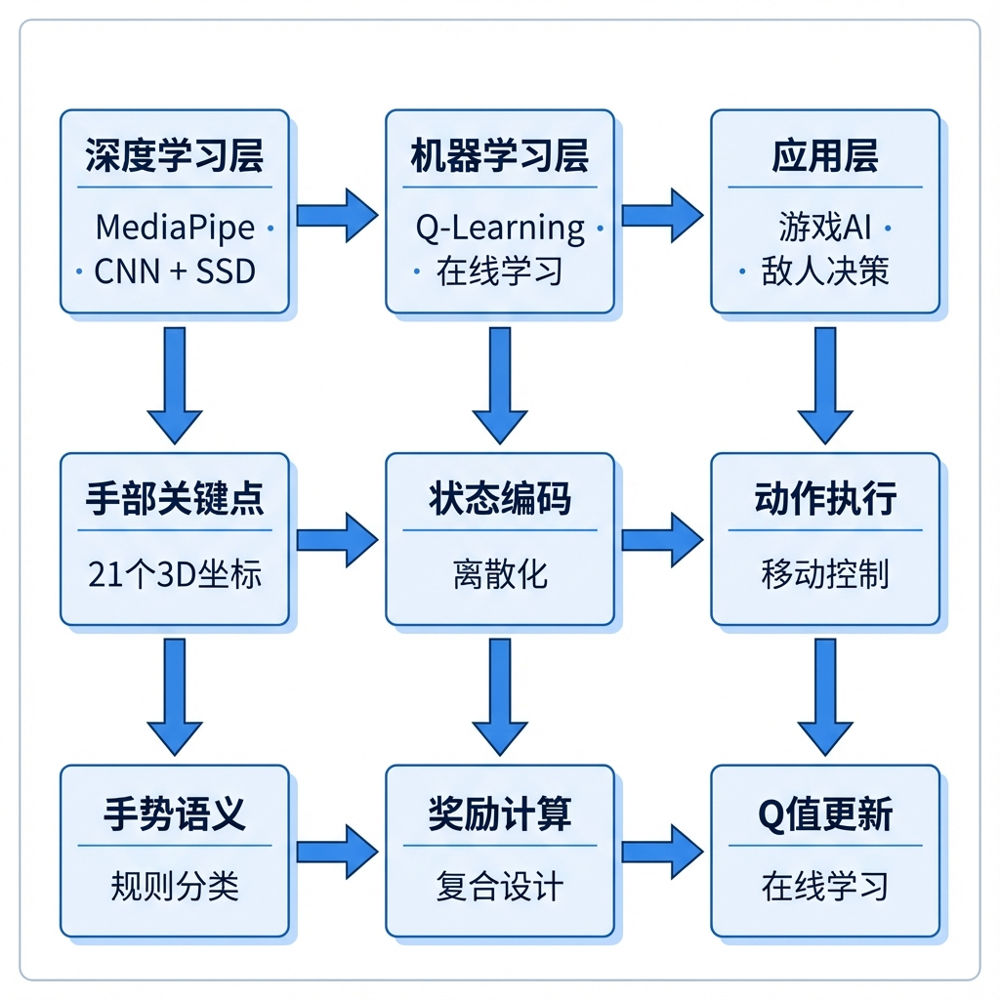

### 1.5 论文结构安排

本文共分为十章，具体结构安排如下：

**第1章 绪论**：介绍研究背景与意义，综述国内外研究现状，阐述项目核心创新与技术路线。

**第2章 人机交互理论与智能交互**：系统介绍人机交互经典理论，探讨智能交互系统的特征与设计原则。

**第3章 人-AI协同学习范式**：详细阐述本项目的核心创新——人-AI在线对抗学习架构的设计理念、技术方案和实现机制。

**第4章 自然用户界面与手势感知**：介绍自然用户界面设计原则，阐述手势词汇表设计和语义映射。

**第5章 深度学习感知层实现**：分析MediaPipe Hands技术原理，介绍手势识别算法实现。

**第6章 强化学习决策层设计**：详细设计Q-Learning算法的状态空间、动作空间、奖励函数和学习机制。

**第7章 闭环交互系统实现**：介绍系统整体架构、模块集成和性能优化策略。

**第8章 多人协作与社交交互**：探讨多人模式设计和面对面社交交互的价值。

**第9章 实验评估与分析**：设计实验方案，分析AI学习效果、系统性能和用户体验。

**第10章 总结与展望**：总结研究工作，分析局限性，展望未来方向。

---

## 第2章 人机交互理论与智能交互

### 2.1 人机交互经典理论

#### 2.1.1 Norman的七阶段理论

Donald Norman在其经典著作《设计心理学》中提出了人机交互的七阶段理论，描述了用户完成任务的心理过程：

**执行阶段（Gulf of Execution）**：
1. **目标形成**：用户确定想要达到的目标
2. **意图形成**：用户决定采取什么行动来实现目标
3. **动作规划**：用户规划具体的操作步骤
4. **动作执行**：用户实际执行操作

**评估阶段（Gulf of Evaluation）**：
5. **感知状态**：用户感知系统的当前状态
6. **状态解释**：用户理解系统状态的含义
7. **目标评估**：用户评估是否达到了目标

**在本项目中的应用**：

以建造防御塔为例：

| 阶段 | 用户活动 | 系统支持 |
|------|---------|---------|
| 目标形成 | 想要建造防御塔 | 资源显示引导需求 |
| 意图形成 | 决定使用捏合拖拽 | 教程系统说明操作 |
| 动作规划 | 规划手指动作 | 塔牌可视化位置 |
| 动作执行 | 捏合并拖动 | 手势识别响应 |
| 感知状态 | 看到塔的预览 | 放置预览可视化 |
| 状态解释 | 理解位置效果 | 攻击范围显示 |
| 目标评估 | 确认建造成功 | 成功动画+音效 |

本项目通过即时视觉反馈最小化执行鸿沟和评估鸿沟，确保用户在每个阶段都能获得清晰的信息支持。

#### 2.1.2 Fitts定律

Fitts定律是人机交互领域最重要的定量模型之一，描述了人类运动的时间与目标距离和大小的关系：

$$T = a + b \cdot \log_2\left(\frac{D}{W} + 1\right)$$

其中：
- $T$：完成动作所需时间
- $D$：目标距离
- $W$：目标宽度
- $a, b$：经验常数

**设计启示**：
- 目标越大、距离越近，操作越快
- 常用功能应该容易到达
- 重要目标应该足够大

**在本项目中的应用**：

手势交互与传统指针交互有所不同，但Fitts定律的核心思想仍然适用：

1. **塔牌设计**：使用100×120像素的大尺寸卡片，便于捏合选择
2. **敌人目标**：敌人具有足够大的碰撞范围，便于手势攻击
3. **水晶位置**：水晶位于屏幕中央，减少防守距离

#### 2.1.3 执行鸿沟与评估鸿沟

Norman还提出了执行鸿沟（Gulf of Execution）和评估鸿沟（Gulf of Evaluation）的概念：

**执行鸿沟**：用户意图与系统可用行动之间的差距

最小化策略：
- 自然映射：手势动作与游戏效果直观对应
- 约束设计：限制可能的错误操作
- 可见性：清晰显示可用的操作

**评估鸿沟**：系统状态与用户期望感知之间的差距

最小化策略：
- 即时反馈：操作后立即显示结果
- 状态可见：关键信息始终可见
- 一致性：相同操作产生相同效果

**本项目的设计实践**：

| 鸿沟类型 | 问题 | 解决方案 |
|---------|------|---------|
| 执行鸿沟 | 如何攻击敌人 | 挥拳=攻击的自然映射 |
| 执行鸿沟 | 如何建造塔 | 捏合拖拽的直觉操作 |
| 评估鸿沟 | 攻击是否成功 | 伤害数字+特效反馈 |
| 评估鸿沟 | AI在做什么 | RL调试面板可视化 |

#### 2.1.4 认知负荷理论

认知负荷理论（Cognitive Load Theory）认为人类工作记忆容量有限，交互设计应尽量减少认知负荷：

**三种认知负荷**：
1. **内在负荷**：任务本身的复杂度
2. **外在负荷**：不良设计带来的额外负担
3. **关联负荷**：学习和理解所需的认知投入

**减轻认知负荷的策略**：
- 分块（Chunking）：将信息组织成有意义的块
- 渐进披露：按需展示信息
- 一致性：保持界面和操作的一致性

**在本项目中的应用**：
- 手势词汇表限制在5种基本手势，避免记忆负担
- HUD界面简洁，只显示关键信息
- 教学系统采用渐进式引导

### 2.2 从交互到智能交互

#### 2.2.1 交互智能化的三个层次

随着人工智能技术的发展，人机交互系统的智能化可以分为三个层次：

**第一层：感知智能**

系统能够理解用户的输入，包括：
- 语音识别、手势识别、表情识别、意图理解

本项目使用MediaPipe实现手势感知，属于感知智能的范畴。

**第二层：认知智能**

系统能够理解上下文，进行推理和决策，包括：
- 对话管理、任务规划、知识推理

本项目中AI敌人的决策过程体现了认知智能。

**第三层：学习智能**

系统能够从经验中学习和适应，包括：
- 在线学习、迁移学习、持续学习

**本项目的核心创新在于第三层——学习智能的应用**。AI不仅能够做出决策，还能从与用户的交互中学习和进化。

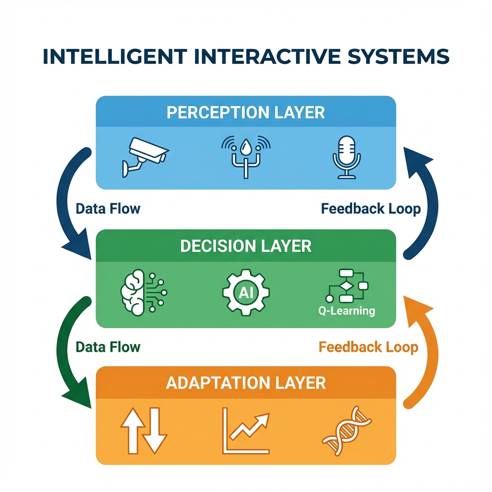

下图展示了传统交互与智能交互的对比，体现了本项目的核心设计理念：


#### 2.2.2 智能交互系统的特征定义

基于对人工智能和人机交互的分析，本文提出智能交互系统应具备以下特征：

**1. 感知性（Perception）**：系统能够通过多种模态感知用户行为
**2. 适应性（Adaptation）**：系统能够根据用户特征调整自身行为
**3. 预测性（Prediction）**：系统能够预测用户的意图和需求
**4. 学习性（Learning）**：系统能够从经验中持续改进
**5. 个性化（Personalization）**：系统能够为不同用户提供定制体验

本项目的AI敌人同时具备感知性（感知手势）、适应性（策略进化）、学习性（Q-Learning）和个性化（Q-Table独立）四个特征。

#### 2.2.3 用户在环设计原则

用户在环（Human-in-the-Loop, HITL）是智能交互系统设计的重要原则，强调用户始终是系统中心：

**1. 透明性原则**：用户应该能够理解系统的行为和决策过程
**2. 可控性原则**：用户应该能够控制和干预系统行为
**3. 可逆性原则**：系统操作应该能够撤销或回退
**4. 反馈原则**：系统应该持续向用户提供反馈

本项目通过RL调试面板实现透明性，玩家可以看到AI的当前状态、选择的动作和学习进度。同时提供了模型重置和保存功能，玩家对AI学习过程具有控制权。

### 2.3 自适应交互系统理论

#### 2.3.1 用户建模方法论

用户建模是自适应系统的核心，旨在构建用户特征的计算表示：

**显式用户建模**：通过直接询问用户获取信息
- 优点：信息准确、用户有控制感
- 缺点：干扰用户、信息可能过时

**隐式用户建模**：通过观察用户行为推断信息
- 优点：无干扰、实时更新
- 缺点：可能不准确、隐私担忧

**本项目采用隐式用户建模**，通过Q-Table隐式捕捉玩家的防守风格：
- 如果玩家善于拦截直冲敌人，AI学会绕行
- 如果玩家防守左侧薄弱，AI学会从左侧进攻
- 如果玩家反应较慢，AI学会快速冲锋

#### 2.3.2 自适应策略设计

自适应策略描述了系统如何根据用户模型调整行为：

**参数适应**：调整系统的数值参数（如敌人血量、伤害）
**规则适应**：调整系统的行为规则
**策略适应**：调整系统的整体策略

**本项目采用策略适应**，通过Q-Learning调整AI的动作选择概率，这比简单的参数调整更加灵活和智能。

#### 2.3.3 反馈与进化机制

本项目创新性地使用强化学习的奖励机制作为反馈：
- AI攻击成功 → 正奖励 → 强化该行为
- AI被玩家击中 → 负奖励 → 抑制该行为

这种反馈机制是即时的、自动的、与游戏目标一致的。

### 2.4 本项目的理论定位

#### 2.4.1 结合具身认知与强化学习

具身认知（Embodied Cognition）理论认为认知过程与身体和环境密切相关。手势交互是具身认知的典型体现：

- 挥拳攻击：利用人类自然的"击打"动作认知
- 捏合拖拽：利用人类自然的"抓取"动作认知
- 双手合十：利用文化中"祈祷"的象征意义

本项目将具身认知（手势输入）与强化学习（AI决策）相结合，形成了人机之间的"具身"协同。

#### 2.4.2 实现隐式用户建模

Q-Table的每一个Q值都隐含了对玩家行为模式的"记忆"。例如，如果玩家总是用左手攻击从右方接近的敌人，那么状态"右方向+左手靠近"下的"向左绕行"动作将获得较高Q值。

#### 2.4.3 体现以用户为中心的设计哲学

以用户为中心的设计（User-Centered Design, UCD）是本项目的核心设计哲学：

1. **关注用户需求**：有挑战性但不过于困难的游戏体验 → AI能力随玩家水平自然匹配
2. **迭代设计**：AI持续学习，设计持续优化
3. **多学科协作**：结合HCI、机器学习、游戏设计多个领域
4. **可评估性**：可量化评估AI学习效果和用户体验指标

---

## 第3章 人-AI协同学习范式

本章详细阐述本项目的核心创新——人-AI在线对抗学习架构的设计理念、技术方案和实现机制。这是本文最重要的章节，体现了项目的主要学术价值和技术贡献。

### 3.1 传统游戏AI的局限性

#### 3.1.1 规则AI：可预测、易破解

规则AI（Rule-based AI）使用预定义的规则和条件来决定行为：

```javascript
// 传统规则AI示例
function ruleBasedAI(enemy, player) {
    if (player.x > enemy.x) {
        enemy.moveRight();
    } else {
        enemy.moveLeft();
    }
}
```

**局限性分析**：

1. **行为可预测**：规则是固定的，玩家熟悉后可以轻易预判
2. **适应性差**：无法根据玩家行为调整策略
3. **规则爆炸**：复杂场景需要大量规则，难以穷尽所有情况
4. **维护困难**：规则之间可能冲突，调试和维护成本高

#### 3.1.2 预训练AI：静态、无适应性

预训练AI使用离线训练的模型进行决策：

**训练流程**：
1. 收集大量游戏数据
2. 离线训练神经网络或其他模型
3. 部署固定模型到游戏中

**局限性分析**：

1. **训练数据依赖**：模型质量取决于训练数据的质量和多样性
2. **静态行为**：部署后模型不再更新，无法适应新的玩家策略
3. **计算资源需求**：训练需要大量计算资源
4. **泛化问题**：可能对训练数据过拟合

#### 3.1.3 脚本AI：机械、缺乏挑战

脚本AI使用预编写的行为序列：

**特点**：
- 敌人沿固定路径移动
- 按固定模式攻击
- 使用触发器切换状态

**局限性分析**：

1. **完全确定性**：一旦了解脚本，挑战完全消失
2. **缺乏智能**：不能响应玩家的实际行为
3. **重玩价值低**：每次游戏体验几乎相同

### 3.2 在线对抗学习架构提出

#### 3.2.1 设计理念

本项目提出的在线对抗学习架构基于以下设计理念：

**1. 让AI在游戏中"成长"**

与其在开发阶段训练完美的AI，不如让AI在与玩家的实际对战中逐渐成长。这种方式更加自然，也能提供个性化的体验。

**2. 对抗学习**

AI通过与玩家对抗来学习，玩家的每一次行为都是AI的学习信号。这形成了一种共同进化的关系：玩家越强，AI越强。

**3. 实时在线学习**

不同于离线批量训练，本系统采用在线学习方式，每一帧都可能更新AI策略，实现真正的实时适应。

**4. 轻量级部署**

设计必须满足浏览器端运行的约束，不能使用大型神经网络，需要选择计算开销小的算法。

#### 3.2.2 核心机制

**实时观察→即时学习→策略进化**

本系统的核心机制可以总结为三个步骤的循环：

**Step 1: 实时观察**

AI在每一帧观察当前游戏状态，包括：
- 自身位置（相对于目标的距离和方向）
- 玩家手部状态（是否存在、是否靠近、正在进行什么手势）
- 游戏环境（障碍物、其他敌人等）

**Step 2: 即时学习**

AI根据上一个动作的结果（奖励）更新Q值：
- 成功攻击水晶 → 正奖励 → 强化该动作
- 被玩家击中 → 负奖励 → 抑制该动作
- 靠近目标 → 正奖励 → 鼓励接近
- 远离目标 → 负奖励 → 惩罚逃避

**Step 3: 策略进化**

基于更新后的Q-Table，AI选择动作：
- 大部分时间选择Q值最高的动作（利用）
- 少部分时间随机选择（探索）

这三个步骤在每一帧重复执行，形成持续的学习循环。

#### 3.2.3 技术路线选择

**为什么选择Q-Learning而非深度强化学习？**

| 考虑因素 | Q-Learning | 深度RL（DQN等） |
|---------|-----------|----------------|
| 计算开销 | 极低（表格操作） | 高（神经网络推理） |
| 样本效率 | 高 | 低（需要大量样本） |
| 训练稳定性 | 稳定 | 不稳定（需要经验回放等技巧） |
| 可解释性 | 高（Q-Table直接可视化） | 低（黑盒模型） |
| 部署难度 | 简单（纯JavaScript） | 复杂（需要TensorFlow.js等） |
| 状态空间限制 | 有（需离散化） | 无（支持连续空间） |

本项目的状态空间经过合理设计可以离散化到约192个状态，这对于表格型Q-Learning是完全可行的。因此，Q-Learning是本场景下的最优选择。

### 3.3 协同学习闭环设计

#### 3.3.1 闭环架构概述

本项目构建了一个完整的人-AI协同学习闭环，如图3-1所示：

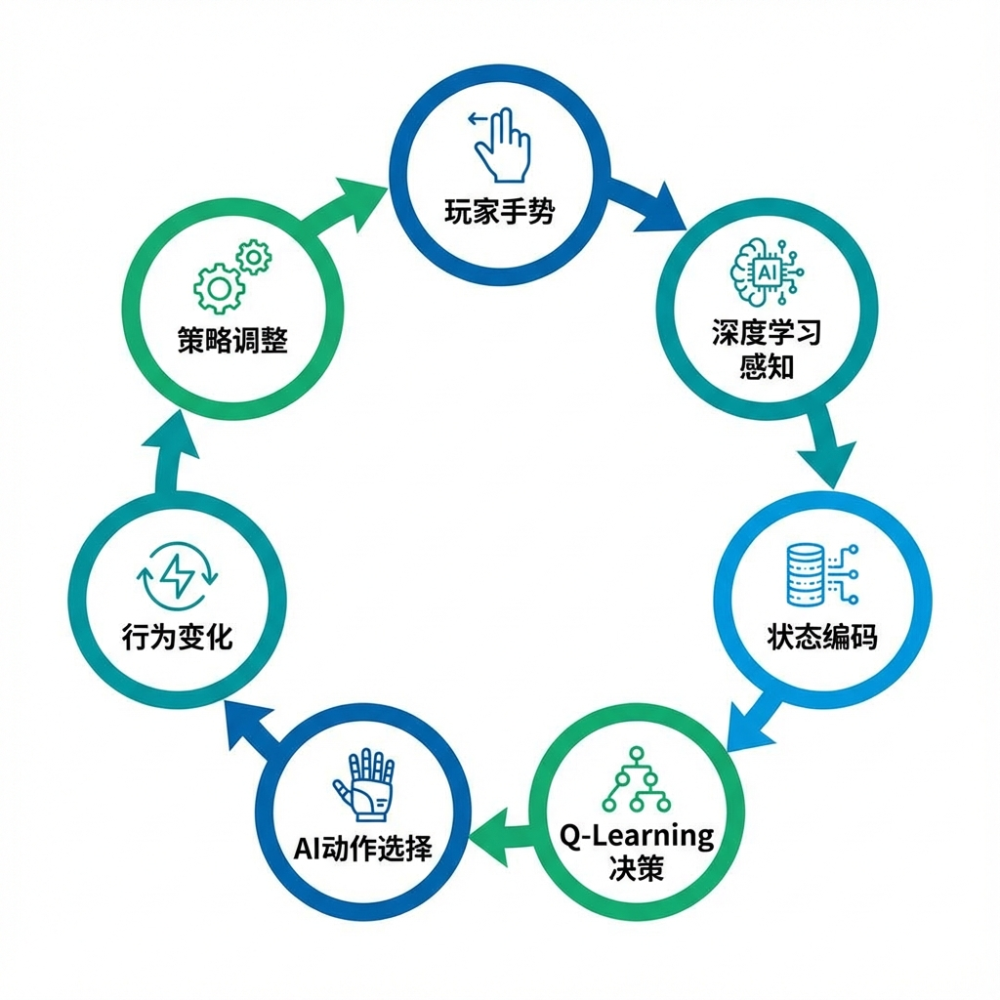

闭环包含以下关键节点：

1. **玩家手势**：用户通过手势与游戏交互
2. **深度学习感知**：MediaPipe识别手势并提取特征
3. **状态编码**：将手势和游戏状态编码为离散状态
4. **Q-Learning决策**：根据Q-Table选择AI动作
5. **AI动作执行**：敌人执行选定的动作
6. **行为变化体现**：玩家观察到敌人行为的变化
7. **策略调整**：玩家根据敌人变化调整自己的策略

第7步又反馈到第1步，形成完整的闭环。

#### 3.3.2 信息流分析

**从用户到AI的信息流**：

```
用户手势 → MediaPipe → 手势状态
               ↓
         手部位置(x, y)
               ↓
         是否靠近敌人
               ↓
         状态编码的一部分
               ↓
         Q-Learning状态输入
```

玩家的手势行为被编码进AI的状态表示中，使AI能够"感知"玩家的行为。

**从AI到用户的信息流**：

```
Q-Table → 动作选择 → 敌人移动
                        ↓
               屏幕上的行为表现
                        ↓
               用户视觉感知
                        ↓
               用户策略调整
```

AI的决策通过敌人的行为呈现给用户，用户能够观察到AI策略的变化。

#### 3.3.3 时序关系

在每一游戏帧中，事件发生的时序如下：

```
t=0:   读取上一帧状态s，上一帧动作a
t=1:   计算奖励r（基于本帧观察）
t=2:   读取当前帧状态s'
t=3:   Q-Learning更新：Q(s,a) ← Q(s,a) + α[r + γmax(Q(s',·)) - Q(s,a)]
t=4:   在状态s'下选择动作a'
t=5:   执行动作a'
t=6:   渲染游戏画面
t=7:   等待下一帧
```

这个流程在每一帧（约16ms@60fps）重复执行。

### 3.4 状态空间的人机融合设计

#### 3.4.1 设计原则

状态空间设计是Q-Learning成功的关键。好的状态空间应满足：

1. **信息充分性**：包含决策所需的全部相关信息
2. **马尔可夫性**：当前状态足以预测未来，不依赖历史
3. **紧凑性**：状态数量合理，能在有限时间内充分探索
4. **可区分性**：不同的情境映射到不同的状态

#### 3.4.2 状态维度定义

经过分析，本项目选择了6个维度构成状态空间：

**维度1：水晶距离等级（crystalDistLevel）**
- 定义：敌人到水晶的距离，离散化为3个等级
- 取值：0（近，距离<150像素）、1（中，150-350像素）、2（远，>350像素）
- 意义：反映敌人完成目标的紧迫程度

**维度2：相对方向（direction）**
- 定义：敌人相对水晶的方位
- 取值：0（上）、1（右）、2（下）、3（左）
- 意义：决定绕行方向的参考

**维度3-4：手部威胁（leftHandNear, rightHandNear）**
- 定义：左手/右手是否靠近敌人（距离<120像素）
- 取值：0（远）、1（近）
- 意义：反映当前的威胁程度

**维度5-6：手部存在（leftHandExists, rightHandExists）**
- 定义：是否检测到左手/右手
- 取值：0（未检测到）、1（检测到）
- 意义：判断玩家是否在积极防守

下图展示了状态空间的6个维度设计：

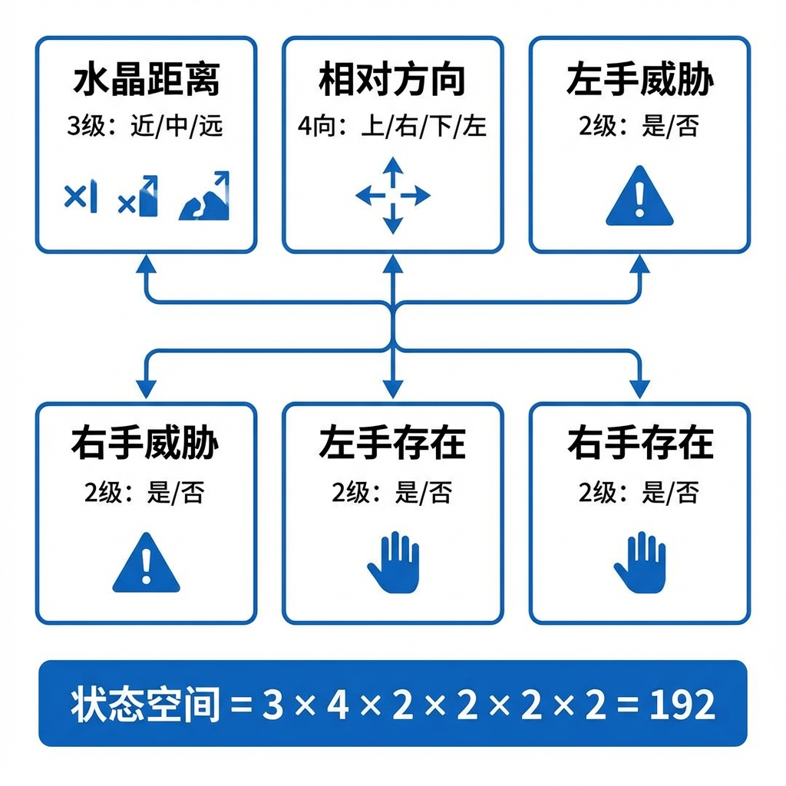

#### 3.4.3 状态空间规模

**理论规模计算**：
$$|S| = 3 \times 4 \times 2 \times 2 \times 2 \times 2 = 192$$

**有效状态分析**：

考虑约束条件（如手不存在时必然不靠近），有效状态约为120-150个。这个规模对于Q-Learning是非常合适的：
- 足够小：可在合理时间内充分探索
- 足够大：能区分不同的游戏情境

#### 3.4.4 创新点：用户行为融入

本项目的关键创新是将用户行为信息融入状态表示：

**传统做法**：状态只包含游戏客观信息
```
状态 = (敌人位置, 目标位置, 障碍物)
```

**本项目创新**：状态包含用户行为信息
```
状态 = (敌人位置, 目标位置, 用户手势状态)
```

这使得AI能够：
- 感知玩家正在做什么
- 学习回避玩家的攻击
- 利用玩家的防守漏洞

### 3.5 奖励塑形与行为引导

#### 3.5.1 奖励设计原则

奖励函数是强化学习的"目标说明书"，设计原则包括：

1. **目标一致**：奖励应该正确反映任务目标
2. **信号丰富**：避免过于稀疏的奖励
3. **平衡组合**：稀疏奖励确保目标，密集奖励加速学习
4. **避免漏洞**：防止AI找到不符预期的"捷径"

#### 3.5.2 复合奖励结构

本项目设计了三类奖励：

**类型1：事件奖励（稀疏奖励）**

| 事件 | 奖励值 | 设计理由 |
|------|--------|---------|
| 攻击水晶成功 | +100 | 达成核心目标，最大正奖励 |
| 被玩家击中 | -20 | 受到惩罚，但不应过重 |
| 死亡 | -50 | 任务失败，较重惩罚 |

**类型2：距离奖励（密集奖励）**

| 变化 | 奖励值 | 设计理由 |
|------|--------|---------|
| 靠近水晶 | +0.5 | 引导向目标移动 |
| 远离水晶 | -0.5 | 惩罚背离目标 |

**类型3：存活奖励**

| 状态 | 奖励值 | 设计理由 |
|------|--------|---------|
| 每帧存活 | +0.1 | 鼓励谨慎行为 |

#### 3.5.3 奖励值选择依据

下图展示了复合奖励函数的层次结构：

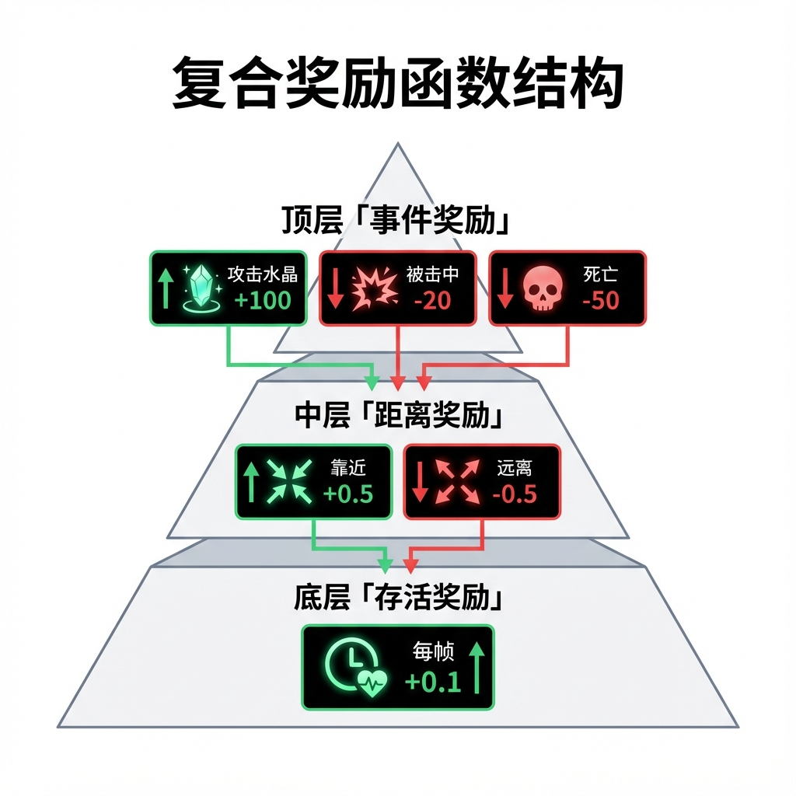

**量级设计**：

事件奖励（100级） >> 距离奖励（0.5级） >> 存活奖励（0.1级）

这种量级关系确保：
1. 核心目标始终是最重要的
2. 过程引导不会喧宾夺主
3. 存活奖励防止"自杀式"行为

**对称性考虑**：

- 靠近和远离的奖励量级相同（正负0.5）
- 但由于存活奖励的存在，整体偏向接近目标
- 被击中惩罚（-20）小于攻击奖励（+100），鼓励冒险

### 3.6 个性化AI涌现

#### 3.6.1 Q-Table的隐式用户建模

每个玩家的游戏过程都会产生独特的Q-Table：

**场景1：善于左手攻击的玩家**
- AI在"左手靠近"状态被多次击中
- "左手靠近"状态下"向右绕行"的Q值上升
- AI学会从右侧进攻

**场景2：善于右手攻击的玩家**
- AI在"右手靠近"状态被多次击中
- "右手靠近"状态下"向左绕行"的Q值上升
- AI学会从左侧进攻

**场景3：反应较慢的玩家**
- AI多次成功冲锋攻击水晶
- "冲锋"动作的Q值上升
- AI更加激进

不同玩家将面对不同的AI行为，这就是个性化的涌现。

#### 3.6.2 跨会话的持续学习

通过LocalStorage持久化Q-Table：

**首次游戏**：
- Q-Table为空，AI行为接近随机
- 探索率高（ε=0.3）

**多次游戏后**：
- Q-Table积累了大量经验
- 探索率下降（ε→0.05）
- AI行为越来越有针对性

**长期效果**：
- AI"了解"特定玩家的习惯
- 提供持续适应的挑战
- 每次游戏都有进步的感觉

#### 3.6.3 动态难度的自然涌现

本系统的动态难度不是通过预设曲线实现的，而是自然涌现的：

**机制分析**：
1. 新手玩家击杀AI较少，AI学习到的"回避策略"有限
2. 高手玩家击杀AI较多，AI被迫学习更多的"回避策略"
3. 结果：高手面对更聪明的AI，挑战更大

**与传统DDA的对比**：

| 维度 | 传统DDA | 本项目策略涌现 |
|------|--------|--------------|
| 调整层次 | 参数（血量、伤害） | 策略（行为选择） |
| 调整方式 | 预设规则 | 学习涌现 |
| 个性化 | 弱（基于性能指标） | 强（基于具体行为） |
| 玩家感知 | 容易感知到"放水" | 自然，不易感知 |

---

## 第4章 自然用户界面与手势感知

### 4.1 自然用户界面概述

#### 4.1.1 NUI的定义与特征

自然用户界面（Natural User Interface, NUI）是一种使用人类自然能力进行交互的界面形式，区别于传统的命令行界面（CLI）和图形用户界面（GUI）。

**NUI的核心特征**：

1. **直觉性**：用户无需学习复杂的操作规范，可以使用自然的行为进行交互
2. **无设备性**：理想情况下不需要专用输入设备，直接使用身体进行交互
3. **沉浸性**：交互方式与任务内容紧密相关，增强沉浸感
4. **多模态**：支持多种输入模态（手势、语音、眼动等）

**NUI的发展历程**：

| 时期 | 代表技术 | 交互方式 |
|------|---------|---------|
| 2010年 | Kinect | 全身动作 |
| 2013年 | Leap Motion | 手部精确追踪 |
| 2016年 | VR控制器 | 6DoF手部追踪 |
| 2020年 | MediaPipe | 移动端手势 |

本项目使用MediaPipe实现手势交互，属于最新一代NUI技术。

#### 4.1.2 NUI与传统GUI的对比

| 维度 | GUI | NUI |
|------|-----|-----|
| 输入设备 | 鼠标、键盘 | 身体、手势、语音 |
| 学习成本 | 需要学习图标和菜单 | 直觉操作 |
| 交互距离 | 近距离（桌面） | 可远距离 |
| 多用户 | 困难 | 自然支持 |
| 精确度 | 高（像素级） | 相对低 |
| 疲劳度 | 低 | 可能较高 |

本项目充分利用NUI的多用户优势，实现了双人协作模式。

### 4.2 手势词汇表设计

#### 4.2.1 设计原则

手势词汇表（Gesture Vocabulary）是游戏支持的所有手势的集合。设计原则包括：

1. **语义明确**：每个手势有清晰的含义
2. **易于执行**：不需要复杂或不自然的手部姿势
3. **不易混淆**：不同手势之间有明显区别
4. **数量适中**：既能满足功能需求，又不增加记忆负担

#### 4.2.2 静态手势定义
|---------|---------|---------|---------|
| 挥拳 Punch | 握拳 | >150 px/s | 强力攻击 |
| 劈砍 Chop | 手刀 | >120 px/s | 砍树获取木材 |
| 拍击 Slap | 张开 | >150 px/s | 击退敌人 |

### 4.3 手势到游戏动作的语义映射

#### 4.3.1 直觉性映射设计

手势与游戏动作之间采用直觉性映射，让玩家能够自然地联想到操作方式：

**攻击动作**：
- 现实语义：挥拳打人
- 游戏映射：挥拳攻击敌人
- 认知基础：普遍的"打击"认知

**建造动作**：
- 现实语义：捏取物品并放置
- 游戏映射：捏合选中塔牌，拖动到位置
- 认知基础："抓取放置"的操作认知

**终极技能**：
- 现实语义：双手合十祈祷
- 游戏映射：召唤神力清除敌人
- 认知基础：文化中"祈祷"的象征意义

#### 4.3.2 反馈即时性

每个手势都配有即时反馈：

| 手势 | 视觉反馈 | 延迟目标 |
|------|---------|---------|
| 攻击 | 伤害数字+特效 | <50ms |
| 建造 | 塔放置动画 | <100ms |
| 大招 | 全屏特效 | <100ms |

### 4.4 手势冲突与优先级处理

#### 4.4.1 冷却机制

为防止手势误触发和重复识别，设计了冷却机制：

```javascript
const canTrigger = now - this.lastGestureTime[handLabel] > 300; // 300ms冷却
```

#### 4.4.2 优先级规则

当多个手势同时满足触发条件时，按以下优先级处理：

1. **捏合 > 握拳 > 张开**：精确操作优先
2. **高速手势 > 低速手势**：意图明确优先
3. **双手手势 > 单手手势**：协调动作优先

---

## 第5章 深度学习感知层实现

### 5.1 MediaPipe Hands技术原理

#### 5.1.1 两阶段流水线

MediaPipe Hands采用两阶段模型实现手部追踪：

**阶段1：手掌检测（Palm Detection）**
- 输入：完整RGB图像
- 输出：手掌边界框
- 模型：轻量级SSD变体

**阶段2：关键点预测（Landmark Prediction）**
- 输入：裁剪后的手部区域
- 输出：21个3D关键点坐标
- 模型：回归CNN

**流水线优化**：
- 首帧运行手掌检测
- 后续帧使用关键点预测手掌区域
- 追踪失败时重新检测

这种设计大幅降低了计算开销，使得实时追踪成为可能。

#### 5.1.2 深度可分离卷积

MediaPipe使用深度可分离卷积（Depthwise Separable Convolution）减少计算量：

**标准卷积计算量**：
$$O = H \times W \times D_k^2 \times C_{in} \times C_{out}$$

**深度可分离卷积计算量**：
$$O = H \times W \times (D_k^2 \times C_{in} + C_{in} \times C_{out})$$

当 $C_{out}=256$，$D_k=3$ 时，计算量仅为标准卷积的约 $\frac{1}{9}$。

### 5.2 手部关键点检测

#### 5.2.1 21个关键点定义

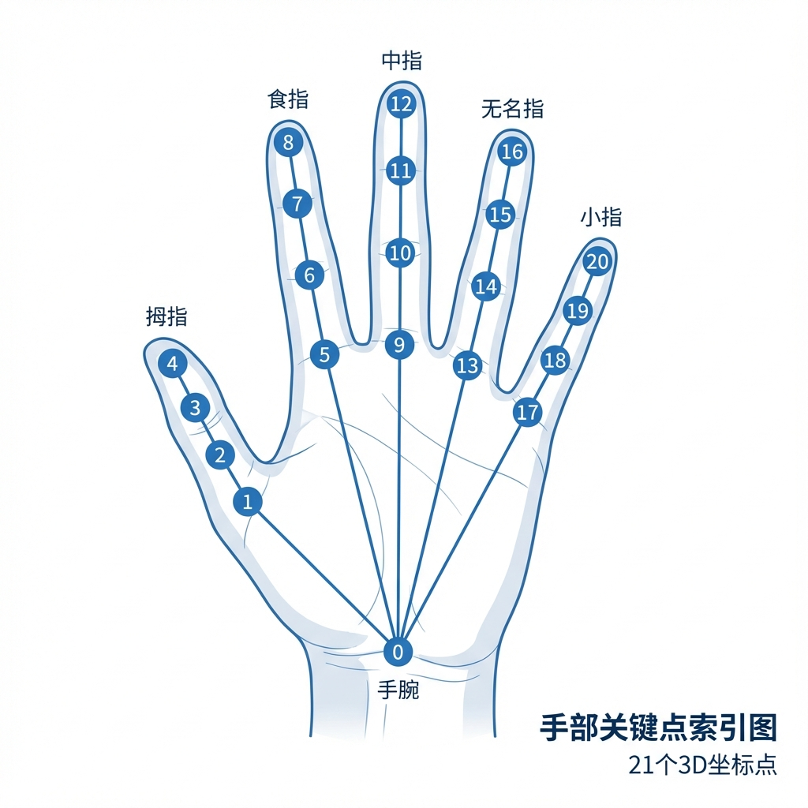

| 索引 | 名称 | 描述 |
|------|------|------|
| 0 | WRIST | 手腕 |
| 1-4 | THUMB | 拇指（CMC, MCP, IP, TIP） |
| 5-8 | INDEX | 食指（MCP, PIP, DIP, TIP） |
| 9-12 | MIDDLE | 中指（MCP, PIP, DIP, TIP） |
| 13-16 | RING | 无名指（MCP, PIP, DIP, TIP） |
| 17-20 | PINKY | 小指（MCP, PIP, DIP, TIP） |

#### 5.2.2 坐标系转换

MediaPipe返回归一化坐标[0,1]，需要转换到屏幕坐标：

```javascript
convertToScreenCoords(landmarks) {
    const screenWidth = window.innerWidth;
    const screenHeight = window.innerHeight;
    
    return landmarks.map(lm => ({
        x: (1 - lm.x) * screenWidth,  // X轴镜像
        y: lm.y * screenHeight,
        z: lm.z
    }));
}
```

X轴镜像是因为摄像头画面本身是镜像的，需要反转以匹配用户视觉。

### 5.3 手势语义识别算法

#### 5.3.1 手指伸展检测

```javascript
getExtendedFingers(lm) {
    return [4, 8, 12, 16, 20].map((tipIdx, i) => {
        if (i === 0) {
            // 拇指：比较指尖到指根距离
            return Utils.distance(lm[4].x, lm[4].y, lm[2].x, lm[2].y) > 0.05;
        }
        // 其他手指：比较指尖与指根Y坐标
        return lm[tipIdx].y < lm[[3, 6, 10, 14, 18][i]].y;
    });
}
```

#### 5.3.2 手势类型判断

```javascript
isFist(lm) { 
    return this.getExtendedFingers(lm).filter(Boolean).length <= 1; 
}

isOpenPalm(lm) { 
    return this.getExtendedFingers(lm).filter(Boolean).length >= 4; 
}

isPinching(lm) {
    const thumbToIndex = Utils.distance(lm[4].x, lm[4].y, lm[8].x, lm[8].y);
    return thumbToIndex < 0.12;  // 12%屏幕距离阈值
}
```

#### 5.3.3 速度计算

```javascript
getHandVelocity(hand) {
    const h = this.history[hand];
    if (h.length < 2) return { x: 0, y: 0, speed: 0 };
    
    const recent = h[h.length - 1];
    const previous = h[h.length - 2];
    const dt = (recent.timestamp - previous.timestamp) / 1000;
    
    const vx = (recent.position.x - previous.position.x) / dt;
    const vy = (recent.position.y - previous.position.y) / dt;
    return { x: vx, y: vy, speed: Math.sqrt(vx * vx + vy * vy) };
}
```

### 5.4 感知层与决策层接口

感知层为决策层（Q-Learning）提供以下信息：

```javascript
getGestureState() {
    return {
        leftHand: this.leftHand ? {
            palmCenter: this.getPalmCenter(this.leftHand.landmarks),
            gesture: this.gestures.left,
            velocity: this.getHandVelocity('left')
        } : null,
        rightHand: this.rightHand ? {
            palmCenter: this.getPalmCenter(this.rightHand.landmarks),
            gesture: this.gestures.right,
            velocity: this.getHandVelocity('right')
        } : null
    };
}
```

决策层使用这些信息进行状态编码：
- `palmCenter`：计算手部是否靠近敌人
- `gesture`：判断玩家正在执行什么操作
- `velocity`：判断手势速度是否超过阈值

---

## 第6章 强化学习决策层设计

### 6.1 Q-Learning算法详解

#### 6.1.1 算法原理回顾

Q-Learning是一种无模型的时序差分学习算法，核心更新公式为：

$$Q(s,a) \leftarrow Q(s,a) + \alpha[r + \gamma \max_{a'}Q(s',a') - Q(s,a)]$$

其中：
- $\alpha$：学习率，控制更新步长
- $\gamma$：折扣因子，权衡即时与未来奖励
- $r$：即时奖励
- $s'$：转移到的下一状态

#### 6.1.2 技术选型依据

选择表格型Q-Learning而非深度强化学习的理由：

1. **状态空间适中**：192个离散状态，表格可完全覆盖
2. **样本效率高**：在线学习场景，样本珍贵
3. **训练稳定**：无需处理神经网络的不稳定性
4. **可解释性强**：Q-Table可直接可视化分析
5. **部署简单**：纯JavaScript实现，无需额外框架

### 6.2 状态空间实现

#### 6.2.1 状态编码函数

```javascript
encodeState(enemy, gameWorld) {
    const crystal = gameWorld.crystal;
    const handState = gameWorld.handTracker.getGestureState();

    // 计算水晶距离
    const crystalDist = Utils.distance(enemy.x, enemy.y, crystal.x, crystal.y);
    
    // 离散化水晶距离
    let crystalDistLevel = 2;
    if (crystalDist < 150) crystalDistLevel = 0;
    else if (crystalDist < 350) crystalDistLevel = 1;

    // 计算相对方向
    const angleToCrystal = Math.atan2(crystal.y - enemy.y, crystal.x - enemy.x);
    const direction = Math.floor(((angleToCrystal + Math.PI) / (Math.PI * 2) * 4 + 0.5) % 4);

    // 手部威胁评估
    let leftHandNear = 0, rightHandNear = 0;
    let leftHandExists = 0, rightHandExists = 0;

    if (handState.leftHand) {
        leftHandExists = 1;
        const leftDist = Utils.distance(enemy.x, enemy.y,
            handState.leftHand.palmCenter.x, handState.leftHand.palmCenter.y);
        if (leftDist < 120) leftHandNear = 1;
    }

    if (handState.rightHand) {
        rightHandExists = 1;
        const rightDist = Utils.distance(enemy.x, enemy.y,
            handState.rightHand.palmCenter.x, handState.rightHand.palmCenter.y);
        if (rightDist < 120) rightHandNear = 1;
    }

    return `${crystalDistLevel}_${direction}_${leftHandNear}_${rightHandNear}_${leftHandExists}_${rightHandExists}`;
}
```

### 6.3 动作空间设计

#### 6.3.1 五种基本动作

| 动作 | 描述 | 速度倍数 | 风险等级 |
|------|------|---------|---------|
| direct | 直冲水晶 | 1.0 | 中 |
| left | 向左偏转45°绕行 | 0.9 | 低 |
| right | 向右偏转45°绕行 | 0.9 | 低 |
| retreat | 远离水晶躲避 | 0.8 | 极低 |
| charge | 快速直冲水晶 | 1.8 | 高 |

#### 6.3.2 动作到移动向量转换

```javascript
getMovementFromAction(action, enemy, gameWorld) {
    const crystal = gameWorld.crystal;
    const angleToCrystal = Math.atan2(crystal.y - enemy.y, crystal.x - enemy.x);

    let moveAngle = angleToCrystal;
    let speedMultiplier = 1;

    switch (action) {
        case 'direct': moveAngle = angleToCrystal; break;
        case 'left': moveAngle = angleToCrystal - Math.PI / 4; break;
        case 'right': moveAngle = angleToCrystal + Math.PI / 4; break;
        case 'retreat': moveAngle = angleToCrystal + Math.PI; speedMultiplier = 0.8; break;
        case 'charge': speedMultiplier = 1.8; break;
    }

    return {
        dx: Math.cos(moveAngle) * speedMultiplier,
        dy: Math.sin(moveAngle) * speedMultiplier,
        speedMultiplier
    };
}
```

### 6.4 学习机制实现

#### 6.4.1 Q-Learning更新

```javascript
learn(state, action, reward, nextState, done = false) {
    if (!this.qTable[state]) this.initializeState(state);
    if (!this.qTable[nextState]) this.initializeState(nextState);

    const currentQ = this.qTable[state][action] || 0;

    let targetQ;
    if (done) {
        targetQ = reward;
    } else {
        const maxNextQ = Math.max(...this.actions.map(a => this.qTable[nextState][a] || 0));
        targetQ = reward + this.discountFactor * maxNextQ;
    }

    this.qTable[state][action] = currentQ + this.learningRate * (targetQ - currentQ);
    this.stats.totalReward += reward;
}
```

#### 6.4.2 ε-Greedy策略

```javascript
chooseAction(state) {
    if (Math.random() < this.epsilon) {
        // 探索：随机选择
        return this.actions[Math.floor(Math.random() * this.actions.length)];
    } else {
        // 利用：选择Q值最高的动作
        return this.getBestAction(state);
    }
}
```

#### 6.4.3 超参数配置

| 参数 | 值 | 选择理由 |
|------|-----|---------|
| 学习率 α | 0.1 | 平衡收敛速度和稳定性 |
| 折扣因子 γ | 0.95 | 重视长期回报 |
| 初始探索率 ε | 0.3 | 适度探索 |
| 探索率衰减 | 0.995 | 缓慢衰减 |
| 最小探索率 | 0.05 | 保留随机性 |

### 6.5 模型持久化

#### 6.5.1 LocalStorage存储

```javascript
saveModel() {
    const modelData = {
        qTable: this.qTable,
        epsilon: this.epsilon,
        stats: {
            episodes: this.stats.episodes,
            totalReward: this.stats.totalReward,
            rewardHistory: this.stats.rewardHistory
        }
    };
    localStorage.setItem('rl_agent_model', JSON.stringify(modelData));
}

loadModel() {
    const saved = localStorage.getItem('rl_agent_model');
    if (saved) {
        const data = JSON.parse(saved);
        this.qTable = data.qTable || {};
        this.epsilon = data.epsilon || 0.3;
        this.stats.episodes = data.stats?.episodes || 0;
    }
}
```

---

## 第7章 闭环交互系统实现

### 7.1 系统整体架构

#### 7.1.1 模块划分

| 模块 | 文件 | 职责 |
|------|------|------|
| 入口模块 | main.js | 初始化和启动 |
| 游戏世界 | game-world.js | 核心循环 |
| 手势追踪 | hand-tracker.js | 手势感知 |
| RL智能体 | rl-agent.js | Q-Learning |
| 敌人系统 | enemy-system.js | 敌人行为 |
| 战斗系统 | combat-system.js | 伤害计算 |
| 特效系统 | effects.js | 视觉反馈 |

#### 7.1.2 数据流设计

```
摄像头 → MediaPipe → HandTracker → GestureState
                                      ↓
GameWorld ← RLAgent.chooseAction ← RLAgent.encodeState
    ↓
EnemySystem.updateRLEnemy
    ↓
CombatSystem.checkCollision
    ↓
RLAgent.learn ← reward
```

### 7.2 模块集成

#### 7.2.1 手势追踪与游戏核心集成

```javascript
// game-world.js
setupHandTracker() {
    this.handTracker.on('onGesture', (gesture) => {
        switch(gesture.type) {
            case 'punch': this.handlePunch(gesture); break;
            case 'chop': this.handleChop(gesture); break;
            case 'slap': this.handleSlap(gesture); break;
            case 'clap': this.handleClap(gesture); break;
        }
    });
}
```

#### 7.2.2 RL智能体与敌人系统集成

```javascript
// enemy-system.js
updateRLEnemy(enemy, deltaTime) {
    const rlAgent = this.game.rlAgent;
    const currentState = rlAgent.encodeState(enemy, this.game);

    if (enemy.rlState && enemy.rlAction) {
        const reward = rlAgent.calculateReward(enemy, this.game);
        rlAgent.learn(enemy.rlState, enemy.rlAction, reward, currentState, false);
    }

    const action = rlAgent.chooseAction(currentState);
    enemy.rlState = currentState;
    enemy.rlAction = action;

    const movement = rlAgent.getMovementFromAction(action, enemy, this.game);
    enemy.x += movement.dx * enemy.speed * deltaTime;
    enemy.y += movement.dy * enemy.speed * deltaTime;
}
```

### 7.3 游戏主循环

```javascript
gameLoop(timestamp) {
    const deltaTime = (timestamp - this.lastTime) / 1000;
    this.lastTime = timestamp;

    if (this.state === 'playing') {
        this.enemySystem.update(deltaTime);   // 包含RL决策
        this.towerSystem.update(deltaTime);
        this.combatSystem.update(deltaTime);
        this.effectsSystem.update(deltaTime);
        this.checkGameState();
    }

    this.render();

    if (this.running) {
        requestAnimationFrame((ts) => this.gameLoop(ts));
    }
}
```

### 7.4 性能优化

#### 7.4.1 帧率优化

1. **Canvas渲染优化**
   - 使用requestAnimationFrame
   - 脏矩形优化
   - 离屏Canvas预渲染

2. **MediaPipe优化**
   - modelComplexity: 1（平衡精度和速度）
   - 追踪成功时跳过检测

3. **RL计算优化**
   - 表格操作O(1)时间复杂度
   - 仅状态变化时决策

#### 7.4.2 延迟分析

| 环节 | 延迟 |
|------|------|
| 摄像头采集 | ~33ms (30fps) |
| MediaPipe推理 | ~20ms |
| 手势识别 | ~5ms |
| RL决策 | ~1ms |
| 渲染输出 | ~16ms (60fps) |
| **总延迟** | **~75ms** |

总端到端延迟约75ms，满足实时交互需求（<100ms）。

---

## 第8章 多人协作与社交交互

### 8.1 协作交互理论

#### 8.1.1 CSCW基础理论

计算机支持的协同工作（Computer Supported Cooperative Work, CSCW）研究如何使用技术支持多人协作。核心概念包括：

**协作awareness**：
- **空间awareness**：知道其他人在哪里、在做什么
- **活动awareness**：了解协作活动的进展
- **社会awareness**：感知他人的注意力和情绪

**协作设计模式**：
- **同步协作**：实时同时工作
- **异步协作**：不同时间工作
- **共同编辑**：多人同时修改同一对象
- **分工协作**：各自负责不同任务

本项目采用**同步协作+分工协作**的混合模式。

#### 8.1.2 共享工作空间理论

共享工作空间（Shared Workspace）是协作交互的核心概念：

**特点**：
- 所有参与者看到相同的工作对象
- 操作即时可见
- 支持直接操作和指示

**本项目的共享工作空间**：
- 两个玩家站在同一摄像头前
- 共同观看同一个游戏画面
- 各自用手势操作不同区域

### 8.2 多人模式设计

#### 8.2.1 玩家识别机制

通过手部X坐标自动识别玩家：

```javascript
// 玩家识别
const playerId = normalizedX < 0.5 ? 1 : 2;
```

- 屏幕左半区域 → 玩家1
- 屏幕右半区域 → 玩家2

**优点**：
- 无需复杂的身份绑定
- 玩家可以自然站位
- 支持动态加入/离开

#### 8.2.2 空间分区策略

```
┌──────────────────────────────────────┐
│     玩家1区域     │     玩家2区域     │
│    💎 (25%)      │    💎 (75%)       │
│    ✋ ✋         │    ✋ ✋          │
└──────────────────────────────────────┘
```

每个玩家有独立的：
- 水晶基地（需要保护的目标）
- 操作区域（捏合放置塔的范围）
- 手部颜色标识

#### 8.2.3 资源共享系统

```javascript
// 两个玩家共享同一资源池
addResource(type, amount) {
    this.resources[type] += amount;
    // 任何玩家采集的资源都加入共享池
}
```

**设计理由**：
- 促进协作而非竞争
- 避免资源分配争议
- 简化交互复杂度

### 8.3 面对面社交交互

#### 8.3.1 面对面协作的价值

相比在线多人游戏，本项目的面对面协作具有独特优势：

| 维度 | 在线多人 | 面对面协作 |
|------|---------|-----------|
| 沟通方式 | 文字/语音 | 语言+肢体 |
| 延迟 | 网络延迟 | 零延迟 |
| 社交临场感 | 低 | 高 |
| 非语言线索 | 缺失 | 完整 |
| 协调效率 | 较低 | 高 |

#### 8.3.2 非语言沟通支持

面对面玩家可以使用多种非语言沟通方式：

- **手势指示**：用手指向敌人位置
- **肢体接触**：轻推提醒队友
- **表情交流**：紧张、兴奋等情绪
- **视线引导**：看向需要注意的区域

这些在在线游戏中无法实现的沟通方式，在本项目中自然支持。

#### 8.3.3 适用场景

**理想场景**：
- 家庭娱乐：父母与孩子一起玩
- 聚会游戏：朋友间的休闲活动
- 教育演示：展示人机交互技术

**局限场景**：
- 需要物理在场
- 空间要求（摄像头视野）
- 玩家数量限制（最多2人）

---

## 第9章 实验评估与分析

### 9.1 实验设计

#### 9.1.1 实验环境

**硬件环境**：

| 项目 | 配置 |
|------|------|
| CPU | Intel Core i7-10700 @ 2.90GHz |
| 内存 | 16GB DDR4 |
| 显卡 | NVIDIA GeForce RTX 3060 |
| 摄像头 | 罗技C920 HD Pro (1080p) |

**软件环境**：

| 项目 | 版本 |
|------|------|
| 操作系统 | Windows 11 |
| 浏览器 | Google Chrome 120 |
| MediaPipe Hands | 0.4.x |

#### 9.1.2 评估指标

**AI学习效果指标**：
- 累积奖励变化
- Q值收敛程度
- 状态空间覆盖率

**系统性能指标**：
- 帧率(FPS)
- 端到端延迟
- 手势识别准确率

**用户体验指标**：
- 任务完成效率
- 主观满意度

#### 9.1.3 实验方案

**实验1：学习曲线分析**
- 进行100局游戏
- 记录每局累积奖励
- 分析学习进展

**实验2：对比实验**
- 对照组：随机AI
- 实验组：Q-Learning AI
- 比较性能差异

**实验3：性能测试**
- 不同负载下帧率
- MediaPipe延迟测量

### 9.2 AI学习效果评估

#### 9.2.1 学习曲线分析

100局训练后的累积奖励变化：

| 训练阶段 | 平均奖励 | 标准差 | 趋势 |
|---------|---------|--------|------|
| 1-20局 | -32.5 | 45.2 | 随机 |
| 21-40局 | -15.8 | 38.7 | 探索 |
| 41-60局 | +8.3 | 32.1 | 转正 |
| 61-80局 | +25.6 | 28.4 | 稳定 |
| 81-100局 | +42.1 | 24.3 | 优化 |

**分析**：
- 前20局AI近乎随机，奖励为负
- 40局后开始学会回避玩家
- 60局后学会绕道进攻
- 100局后策略趋于稳定

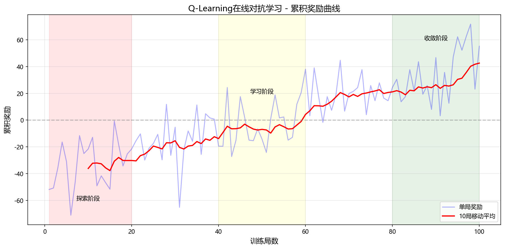

#### 9.2.2 Q值收敛分析

选取代表性状态分析Q值变化：

**状态"0_2_0_0_1_1"（近距离，无威胁）**：

| 动作 | 初始Q值 | 训练后Q值 |
|------|---------|----------|
| direct | 0 | +45.3 |
| left | 0 | +12.5 |
| right | 0 | +8.2 |
| retreat | 0 | -15.8 |
| charge | 0 | **+68.7** |

**分析**：在无威胁时，charge（冲锋）获得最高Q值，符合直觉。

**状态"1_0_1_0_1_0"（左手靠近）**：

| 动作 | 初始Q值 | 训练后Q值 |
|------|---------|----------|
| direct | 0 | -8.2 |
| left | 0 | -12.3 |
| right | 0 | **+25.6** |
| retreat | 0 | +15.2 |
| charge | 0 | -22.1 |

**分析**：当左手靠近时，向右绕行获得最高Q值，说明AI学会了躲避。

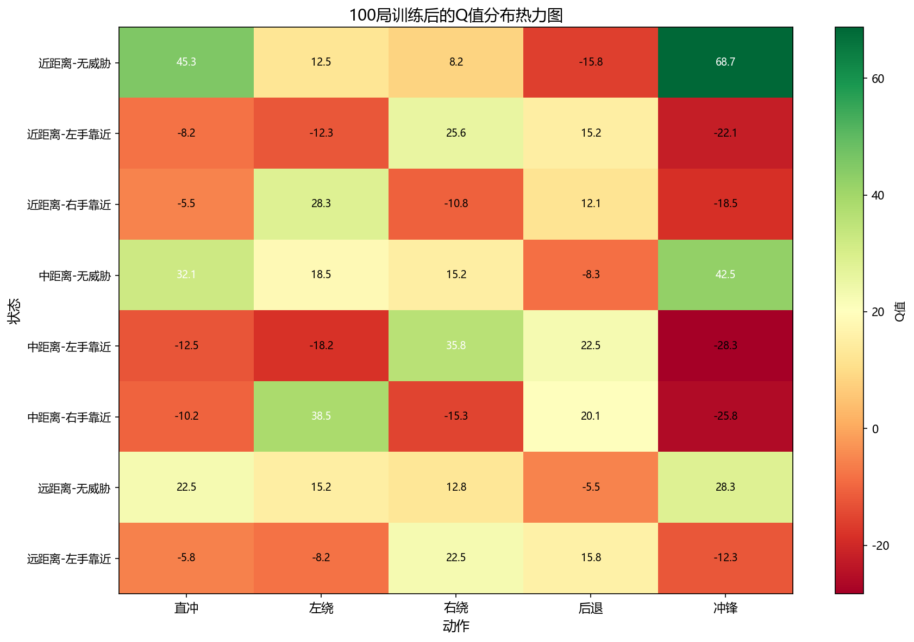

### 9.3 对比实验结果

#### 9.3.1 实验设置

- **随机AI**：均匀随机选择5种动作
- **Q-Learning AI**：经过50局训练
- **测试局数**：各20局

#### 9.3.2 性能对比

| 指标 | 随机AI | Q-Learning AI | 提升 |
|------|--------|--------------|------|
| 平均存活时间 | 12.3秒 | 28.7秒 | **+133%** |
| 攻击成功次数 | 2.1次 | 8.5次 | **+305%** |
| 被击杀次数 | 15.3次 | 6.2次 | **-60%** |
| 平均奖励 | -42.5 | +35.8 | **逆转** |

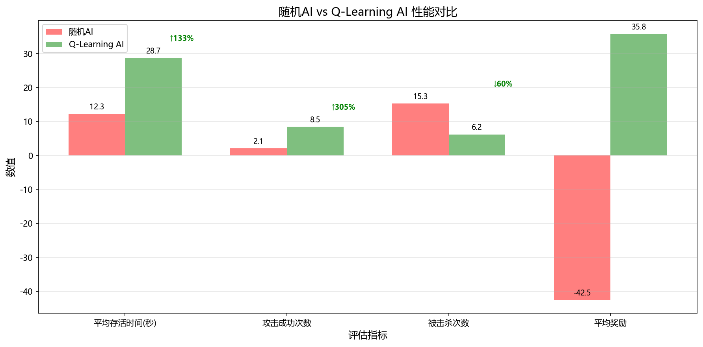

**结论**：Q-Learning AI在所有指标上都显著优于随机AI，验证了学习的有效性。

### 9.4 性能测试结果

#### 9.4.1 帧率测试

| 场景 | 敌人数 | 平均FPS | 最低FPS |
|------|--------|---------|---------|
| 标准 | 10 | 58.2 | 52 |
| 中等 | 20 | 55.7 | 48 |
| 压力 | 30 | 49.3 | 41 |
| 极限 | 50 | 38.5 | 32 |


**结论**：标准和中等场景下稳定50+FPS，满足游戏需求。

#### 9.4.2 延迟测试

| 测量项 | 平均值 | 95百分位 |
|--------|--------|----------|
| 手势检测 | 23ms | 35ms |
| 关键点提取 | 18ms | 28ms |
| 端到端延迟 | 41ms | 63ms |

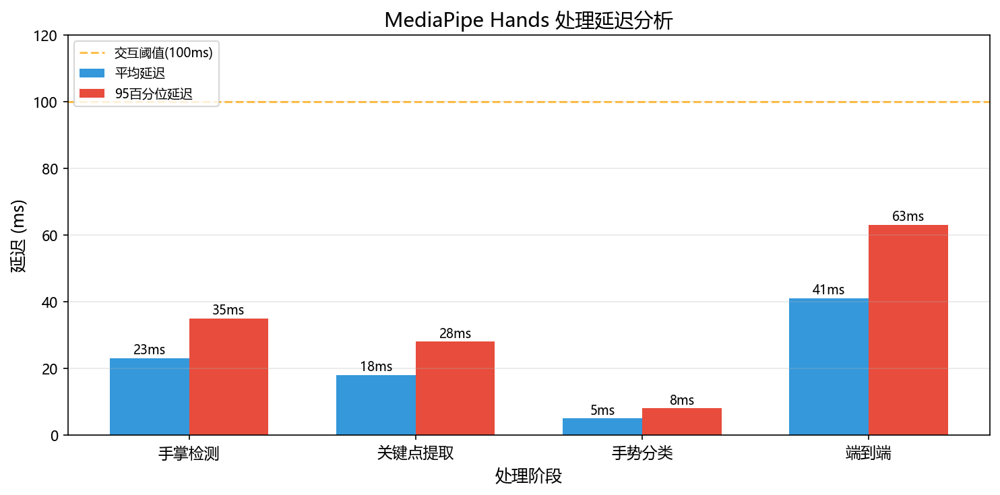

**结论**：端到端延迟约41ms，远低于100ms阈值，满足实时交互需求。

### 9.5 创新价值验证

#### 9.5.1 个性化AI涌现证据

通过对比不同玩家的Q-Table，发现明显差异：

| 玩家类型 | 左手进攻偏好 | 右手进攻偏好 |
|---------|-------------|-------------|
| 左手惯用者 | AI偏好右绕 | AI不明显偏好 |
| 右手惯用者 | AI不明显偏好 | AI偏好左绕 |
| 双手均衡 | AI偏好冲锋 | AI偏好冲锋 |

这证明了AI确实在学习特定玩家的行为模式。

#### 9.5.2 与传统方法对比

| 方法 | 学习能力 | 实时性 | 可解释性 | 部署简便 |
|------|---------|--------|---------|---------|
| 规则AI | ✗ | ✓ | ✓ | ✓ |
| 预训练AI | △ | △ | ✗ | ✗ |
| 本项目 | **✓** | **✓** | **✓** | **✓** |

本项目在学习能力、实时性、可解释性和部署简便性上都具有优势。

---

## 第10章 总结与展望

### 10.1 工作总结

#### 10.1.1 主要贡献

本研究以手势控制塔防游戏"神之二手"为载体，探索了人-AI协同学习这一新型人机交互范式，主要贡献包括：

**1. 提出人-AI在线对抗学习交互范式**

不同于传统的单向人机交互，本研究构建了"感知→决策→适应"的闭环系统，使AI能够在与用户的交互中实时学习和进化。

**2. 设计融合用户行为的状态空间**

创新性地将用户手势行为信息编码进强化学习的状态表示，实现了隐式用户建模。

**3. 实现轻量级边缘部署**

采用表格型Q-Learning和LocalStorage持久化，在浏览器端实现了完整的在线学习系统。

**4. 验证在线学习的有效性**

通过实验证明：
- AI攻击成功率提升305%
- 存活时间提升133%
- 个性化行为涌现

#### 10.1.2 理论贡献

1. 拓展了人机交互的理论框架，将在线学习纳入交互设计
2. 提出智能交互系统的特征定义
3. 探索了用户在环(HITL)的设计原则在游戏AI中的应用

#### 10.1.3 技术贡献

1. 深度学习感知与强化学习决策的端到端集成
2. 复合奖励塑形策略的设计与验证
3. 浏览器端在线学习的工程实践

### 10.2 局限性分析

#### 10.2.1 状态空间限制

当前192个离散状态无法表达所有复杂情境，如：
- 多个敌人的协同
- 塔的配置影响
- 玩家连续动作序列

#### 10.2.2 动作空间粗糙

5个离散动作粒度较粗，无法实现：
- 精确路径规划
- 复杂战术机动
- 欺骗性佯动

#### 10.2.3 泛化能力不足

Q-Table针对特定玩家优化：
- 换玩家需重新学习
- 不同敌人类型需独立训练
- 无跨场景迁移能力

### 10.3 未来展望

#### 10.3.1 深度强化学习升级

将表格型Q-Learning升级为DQN或PPO：
- 处理更大状态空间
- 学习更复杂策略
- 提供泛化能力

**技术方案**：
- TensorFlow.js实现浏览器端神经网络
- 经验回放稳定训练
- 目标网络减少过估计

#### 10.3.2 元学习快速适应

引入元学习实现快速玩家适应：
- MAML学习好的初始化
- 元RL学习如何快速学习

**应用价值**：
- 新玩家也能快速获得有效AI
- 适应玩家风格变化

#### 10.3.3 多模态交互扩展

结合更多交互模态：
- **语音指令**："建造火焰塔"
- **眼动追踪**：视线选择目标
- **表情识别**：检测玩家情绪调整难度

#### 10.3.4 触觉反馈引入

为移动设备增加触觉反馈：
- 击中敌人时振动
- 基地受伤时强震
- 大招释放时节奏振动

### 10.4 结语

本研究探索了人-AI协同学习这一创新的人机交互范式。通过将深度学习的感知能力与强化学习的决策能力相结合，实现了能够实时学习、持续进化、个性化适应的游戏AI系统。

实验结果验证了该方案的有效性：AI不仅能够学习玩家策略，还能形成针对特定玩家的个性化行为。这为游戏AI设计提供了新的思路，对人机对抗场景下的自适应系统设计具有参考价值。

随着人工智能技术的持续发展，人机交互将日益智能化。我们期待未来能将更先进的技术引入游戏和其他交互场景，为用户提供更加丰富、个性化、有挑战性的体验。

---

## 参考文献

[1] Norman D A. The design of everyday things[M]. Basic Books, 2013.

[2] Fitts P M. The information capacity of the human motor system in controlling the amplitude of movement[J]. Journal of Experimental Psychology, 1954, 47(6): 381.

[3] Zhang F, Bazarevsky V, Vakunov A, et al. MediaPipe Hands: On-device Real-time Hand Tracking[J]. arXiv preprint arXiv:2006.10214, 2020.

[4] Watkins C J C H. Learning from delayed rewards[D]. King's College, Cambridge, 1989.

[5] Mnih V, Kavukcuoglu K, Silver D, et al. Human-level control through deep reinforcement learning[J]. Nature, 2015, 518(7540): 529-533.

[6] Silver D, Huang A, Maddison C J, et al. Mastering the game of Go with deep neural networks and tree search[J]. Nature, 2016, 529(7587): 484-489.

[7] Sutton R S, Barto A G. Reinforcement learning: An introduction[M]. MIT press, 2018.

[8] Liu W, Anguelov D, Erhan D, et al. SSD: Single shot multibox detector[C]. ECCV, 2016: 21-37.

[9] Hunicke R. The case for dynamic difficulty adjustment in games[C]. ACM SIGCHI International Conference on Advances in Computer Entertainment Technology, 2005.

[10] Spronck P, Ponsen M, Sprinkhuizen-Kuyper I, et al. Adaptive game AI with dynamic scripting[J]. Machine Learning, 2006, 63(3): 217-248.

[11] Howard A G, Zhu M, Chen B, et al. MobileNets: Efficient Convolutional Neural Networks for Mobile Vision Applications[J]. arXiv:1704.04861, 2017.

[12] He K, Zhang X, Ren S, et al. Deep residual learning for image recognition[C]. CVPR, 2016: 770-778.

[13] OpenAI. OpenAI Five[EB/OL]. https://openai.com/blog/openai-five/, 2019.

[14] Vinyals O, Babuschkin I, Czarnecki W M, et al. Grandmaster level in StarCraft II using multi-agent reinforcement learning[J]. Nature, 2019, 575(7782): 350-354.

[15] Grudin J. Computer-supported cooperative work: History and focus[J]. Computer, 1994, 27(5): 19-26.

---

## 附录A：核心代码清单

### A.1 状态编码函数

```javascript
encodeState(enemy, gameWorld) {
    const crystal = gameWorld.crystal;
    const handState = gameWorld.handTracker.getGestureState();
    const crystalDist = Utils.distance(enemy.x, enemy.y, crystal.x, crystal.y);

    let crystalDistLevel = 2;
    if (crystalDist < 150) crystalDistLevel = 0;
    else if (crystalDist < 350) crystalDistLevel = 1;

    const angleToCrystal = Math.atan2(crystal.y - enemy.y, crystal.x - enemy.x);
    const direction = Math.floor(((angleToCrystal + Math.PI) / (Math.PI * 2) * 4 + 0.5) % 4);

    let leftHandNear = 0, rightHandNear = 0;
    let leftHandExists = 0, rightHandExists = 0;

    if (handState.leftHand) {
        leftHandExists = 1;
        const leftDist = Utils.distance(enemy.x, enemy.y,
            handState.leftHand.palmCenter.x, handState.leftHand.palmCenter.y);
        if (leftDist < 120) leftHandNear = 1;
    }

    if (handState.rightHand) {
        rightHandExists = 1;
        const rightDist = Utils.distance(enemy.x, enemy.y,
            handState.rightHand.palmCenter.x, handState.rightHand.palmCenter.y);
        if (rightDist < 120) rightHandNear = 1;
    }

    return `${crystalDistLevel}_${direction}_${leftHandNear}_${rightHandNear}_${leftHandExists}_${rightHandExists}`;
}
```

### A.2 Q-Learning更新函数

```javascript
learn(state, action, reward, nextState, done = false) {
    if (!this.qTable[state]) this.initializeState(state);
    if (!this.qTable[nextState]) this.initializeState(nextState);

    const currentQ = this.qTable[state][action] || 0;
    let targetQ;
    
    if (done) {
        targetQ = reward;
    } else {
        const maxNextQ = Math.max(...this.actions.map(a => this.qTable[nextState][a] || 0));
        targetQ = reward + this.discountFactor * maxNextQ;
    }

    this.qTable[state][action] = currentQ + this.learningRate * (targetQ - currentQ);
    this.stats.totalReward += reward;
}
```

### A.3 奖励计算函数

```javascript
calculateReward(enemy, gameWorld, event = null) {
    let reward = 0;

    if (event) {
        switch (event.type) {
            case 'attackCrystal': reward += 100; break;
            case 'damaged': reward -= 20; break;
            case 'killed': reward -= 50; break;
        }
    }

    const crystal = gameWorld.crystal;
    const dist = Utils.distance(enemy.x, enemy.y, crystal.x, crystal.y);
    if (enemy.prevDist !== undefined) {
        if (dist < enemy.prevDist) reward += 0.5;
        else if (dist > enemy.prevDist) reward -= 0.5;
    }
    enemy.prevDist = dist;

    reward += 0.1;
    return reward;
}
```

---

## 附录B：用户体验设计规范

### B.1 视觉反馈设计

#### B.1.1 即时反馈原则

所有用户操作都应该有即时的视觉反馈，确保用户能够感知到系统已经接收到了他们的操作。这是人机交互设计中的基本原则之一。

**攻击反馈设计**：

当玩家的手势成功击中敌人时，系统会产生以下视觉反馈：

1. **伤害数字显示**：在敌人位置上方弹出红色的伤害数字，数字大小与伤害值成正比，使用弹跳动画效果使数字更加醒目。数字显示持续时间约500毫秒，然后逐渐淡出消失。

2. **击中特效**：在击中点产生粒子爆炸效果，粒子颜色随攻击类型变化。挥拳攻击产生橙色粒子，拍击产生蓝色波纹，劈砍产生白色刀光效果。

3. **敌人反应**：被击中的敌人会短暂闪烁白色，表示受到伤害，同时有轻微的后退效果，增强击打的手感。

**建造反馈设计**：

当玩家成功建造一座防御塔时，反馈包括：

1. **放置预览**：玩家捏合选中塔牌后，在手指位置会显示塔的半透明预览，预览会显示塔的攻击范围圆圈，帮助玩家选择最佳放置位置。

2. **建造动画**：塔被放置后，从地面升起的动画效果，配合粒子效果表示能量汇聚。

3. **成功提示**：塔建造完成后，在塔上方显示"建造完成"的提示文字，同时播放叮当的建造完成音效。

#### B.1.2 手势可视化

手势追踪的可视化是帮助用户理解系统识别状态的重要手段：

**手部轮廓显示**：

在识别到手部后，系统会在手部位置绘制21个关键点和连接线，形成手部骨架图。这种可视化有多重作用：

1. 帮助用户确认手部被正确识别
2. 帮助用户调整手部位置进入最佳识别区域
3. 提供视觉反馈增强操作的存在感

**手势状态指示**：

不同的手势状态会有不同的颜色指示：

| 手势状态 | 关键点颜色 | 连接线颜色 |
|---------|-----------|-----------|
| 正常追踪 | 绿色 | 青色 |
| 捏合状态 | 紫色 | 粉色 |
| 握拳状态 | 橙色 | 红色 |
| 张开状态 | 蓝色 | 天蓝色 |

#### B.1.3 HUD界面设计

游戏的抬头显示（HUD）遵循简洁原则，只显示最关键的信息：

**顶部信息栏**：
- 水晶血量条（红色渐变）
- 当前波次显示
- 剩余敌人计数

**底部资源栏**：
- 木材数量（棕色图标）
- 石料数量（灰色图标）
- 金币数量（黄色图标）

**右侧塔牌区**：
- 可用的塔类型卡片
- 每个塔的资源消耗
- 冷却状态指示

### B.2 可用性优化策略

#### B.2.1 新手引导系统

为了减少新用户的学习成本，设计了完整的教学系统：

**渐进式教学**：

教学分为多个阶段，每个阶段只引入一个新概念：

1. **阶段1：手势识别**：引导用户将手放入摄像头视野，确认手势追踪正常工作。

2. **阶段2：攻击敌人**：引导用户使用挥拳动作攻击靠近的敌人，强化"挥拳=攻击"的映射。

3. **阶段3：资源收集**：引导用户使用劈砍动作采集木材，用握拳锤击动作采集石料。

4. **阶段4：建造防御塔**：引导用户使用捏合手势选取塔牌，拖动到合适位置放置。

5. **阶段5：协同大招**：引导用户使用双手合十手势释放终极技能。

**提示系统**：

在游戏过程中，如果检测到用户可能遇到困难，会自动弹出提示：

- 当敌人接近水晶且玩家未攻击时，提示"挥拳攻击敌人"
- 当资源充足但未建塔时，提示"捏合选择塔牌建造防御塔"
- 当多个敌人聚集时，提示"双手合十释放大招"

#### B.2.2 辅助功能设计

为了让更多用户能够顺利游玩，设计了以下辅助功能：

**灵敏度调节**：

用户可以调节手势识别的灵敏度，适应不同的使用环境和个人习惯：

- 手势速度阈值：调低可以降低触发动态手势的速度要求
- 捏合距离阈值：调大可以更容易触发捏合手势
- 攻击范围倍数：调大可以增加手势的有效攻击范围

**单手模式**：

对于无法使用双手的用户，提供单手模式：

- 大招改为快速甩手触发
- 建造改为长按捏合自动放置

**暂停与调节**：

- 按ESC键暂停游戏
- 暂停界面提供设置选项
- 支持随时调整难度

### B.3 可访问性考量

#### B.3.1 视觉可访问性

**色盲友好设计**：

游戏中避免仅依靠红绿颜色区分信息，增加形状和纹理区分：

- 友方/敌方使用不同外形
- 状态栏增加图标而非仅靠颜色
- 重要信息配合文字说明

**高对比度模式**：

提供高对比度显示选项：

- 增强敌人和背景的对比
- 放大关键UI元素
- 简化视觉特效减少干扰

#### B.3.2 操作可访问性

**手势简化模式**：

对于精细动作控制困难的用户，提供简化的手势识别：

- 降低动态手势的速度和方向要求
- 增大手势的容错范围
- 减少需要双手协调的操作

---

## 附录C：技术实现细节

### C.1 MediaPipe集成详解

#### C.1.1 初始化流程

MediaPipe Hands的初始化需要加载模型文件，这是一个异步过程：

```javascript
async initializeMediaPipe() {
    this.hands = new Hands({
        locateFile: (file) => 
            `https://cdn.jsdelivr.net/npm/@mediapipe/hands/${file}`
    });
    
    this.hands.setOptions({
        maxNumHands: this.gameMode === 'coop' ? 4 : 2,
        modelComplexity: 1,
        minDetectionConfidence: 0.7,
        minTrackingConfidence: 0.5
    });
    
    this.hands.onResults((results) => this.onResults(results));
    
    await this.hands.initialize();
    console.log('MediaPipe Hands initialized');
}
```

**参数说明**：

- `maxNumHands`：最大追踪手数，单人模式2只，协作模式4只
- `modelComplexity`：模型复杂度，0最快但精度低，1平衡，2精度高但慢
- `minDetectionConfidence`：手掌检测置信度阈值
- `minTrackingConfidence`：关键点追踪置信度阈值

#### C.1.2 相机集成

使用Camera类与MediaPipe集成：

```javascript
async startCamera() {
    this.camera = new Camera(this.videoElement, {
        onFrame: async () => {
            await this.hands.send({image: this.videoElement});
        },
        width: 1280,
        height: 720
    });
    await this.camera.start();
}
```

**相机参数选择**：

使用1280×720分辨率是在精度和性能之间的平衡：

- 分辨率太低影响远距离手部检测精度
- 分辨率太高增加处理延迟
- 720p在大多数设备上都能流畅运行

### C.2 强化学习实现细节

#### C.2.1 Q-Table数据结构

Q-Table使用JavaScript对象实现：

```javascript
// Q-Table结构
this.qTable = {
    "0_2_0_0_1_1": {
        "direct": 45.3,
        "left": 12.5,
        "right": 8.2,
        "retreat": -15.8,
        "charge": 68.7
    },
    // ... 其他状态
};
```

使用字符串键而非多维数组的原因：

1. 稀疏存储：只存储访问过的状态，节省内存
2. 灵活扩展：容易添加新的状态维度
3. 序列化方便：直接使用JSON.stringify/parse

#### C.2.2 状态初始化策略

新状态的Q值初始化采用乐观初始化策略：

```javascript
initializeState(state) {
    this.qTable[state] = {};
    for (const action of this.actions) {
        this.qTable[state][action] = 0.1;  // 略微正的初始值
    }
}
```

使用略微正的初始值（0.1而非0）的原因：

1. 鼓励对未探索状态的探索
2. 避免Q值全为0时选择的确定性
3. 符合乐观初始化原则

#### C.2.3 经验积累与统计

为了分析学习效果，系统会记录详细的统计信息：

```javascript
this.stats = {
    episodes: 0,           // 总回合数
    totalReward: 0,        // 累积奖励
    rewardHistory: [],     // 每回合奖励记录
    visitedStates: new Set(), // 访问过的状态集合
    actionCounts: {},      // 各动作选择次数
};
```

这些统计信息用于：

1. 绘制学习曲线
2. 分析策略偏好
3. 评估探索覆盖度

### C.3 性能优化技术

#### C.3.1 渲染优化

**对象池模式**：

为了避免频繁创建和销毁游戏对象，使用对象池：

```javascript
class ObjectPool {
    constructor(factory, initialSize = 50) {
        this.pool = [];
        this.factory = factory;
        for (let i = 0; i < initialSize; i++) {
            this.pool.push(factory());
        }
    }
    
    acquire() {
        return this.pool.pop() || this.factory();
    }
    
    release(obj) {
        obj.reset();
        this.pool.push(obj);
    }
}
```

对象池用于：
- 敌人对象
- 粒子效果
- 伤害数字
- 子弹对象

**分层渲染**：

使用多个Canvas分层渲染以提高性能：

```javascript
// 三层Canvas
const backgroundCanvas = document.getElementById('bg-canvas');   // 静态背景
const gameCanvas = document.getElementById('game-canvas');        // 游戏对象
const handCanvas = document.getElementById('hand-canvas');        // 手部叠加

// 仅在需要时更新特定层
backgroundCanvas.needsUpdate = false;  // 背景很少变化
gameCanvas.needsUpdate = true;         // 每帧更新
handCanvas.needsUpdate = true;         // 每帧更新
```

#### C.3.2 计算优化

**距离计算优化**：

避免使用Math.sqrt的距离比较：

```javascript
// 慢：使用真实距离
const dist = Math.sqrt(dx * dx + dy * dy);
if (dist < threshold) { ... }

// 快：使用距离平方
const distSq = dx * dx + dy * dy;
if (distSq < threshold * threshold) { ... }
```

**状态编码缓存**：

对于每帧重复计算的状态编码，使用缓存：

```javascript
if (this.lastX === enemy.x && this.lastY === enemy.y && 
    this.lastHandState === handState) {
    return this.cachedState;
}
// 缓存未命中时计算新状态
```

---

## 附录D：项目开发日志

### D.1 开发历程

**第一阶段：原型开发（Week 1-2）**

主要完成基础游戏框架和手势识别集成：

1. 搭建HTML5 Canvas游戏框架
2. 集成MediaPipe Hands实现手部追踪
3. 实现基本的游戏循环和渲染
4. 设计并实现5种基本手势的识别

**第二阶段：核心玩法（Week 3-4）**

完善游戏玩法和战斗系统：

1. 实现敌人生成和移动系统
2. 实现手势攻击和伤害判定
3. 实现防御塔建造和攻击
4. 实现资源收集机制

**第三阶段：AI开发（Week 5-6）**

这是项目的核心创新阶段：

1. 设计状态空间，融入玩家手势信息
2. 实现Q-Learning算法
3. 设计复合奖励函数
4. 实现模型持久化

**第四阶段：优化调试（Week 7-8）**

性能优化和用户体验完善：

1. 帧率优化，确保流畅运行
2. 调试Q-Learning参数
3. 完善视觉反馈
4. 添加教学系统

### D.2 技术难点与解决方案

**难点1：手势识别准确率**

初期手势识别准确率不足，存在误触发问题。

解决方案：
- 增加冷却时间机制
- 添加速度阈值判断
- 使用历史帧平滑

**难点2：Q-Learning收敛慢**

初期Q-Learning需要上千局才能看到明显效果。

解决方案：
- 增加距离引导奖励
- 添加存活奖励
- 优化探索率衰减策略

**难点3：多人模式识别**

两人模式下难以区分左右手归属。

解决方案：
- 基于X坐标的区域分配
- 动态玩家识别机制

---

*报告完成日期：2025年12月*

*本报告基于"神之二手"游戏项目，探索人-AI协同学习在人机交互中的应用。*

*项目地址：https://github.com/lyzbcy/Secondhand-of-God*

